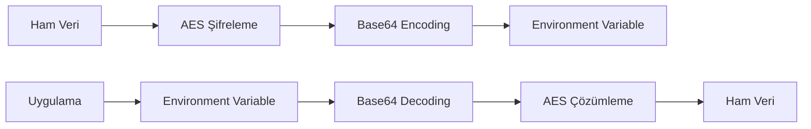

# 🔐 Beyond2C Şifreleme ve Güvenlik Kılavuzu

Bu kılavuz, Beyond2C platformunda hassas bilgilerin nasıl şifrelendiği ve güvenli bir şekilde yönetildiği hakkında detaylı bilgi içerir.

## 📋 İçindekiler

1. [Genel Bakış](#genel-bakış)
2. [Kurulum](#kurulum)
3. [Şifreleme Sistemi](#şifreleme-sistemi)
4. [Environment Variables](#environment-variables)
5. [Kullanım Örnekleri](#kullanım-örnekleri)
6. [Güvenlik Best Practices](#güvenlik-best-practices)
7. [Troubleshooting](#troubleshooting)

## 🌍 Genel Bakış

Beyond2C platformu, hassas bilgileri korumak için AES şifreleme algoritması kullanır. Bu sistem aşağıdaki avantajları sunar:

- **🔒 Güvenli Depolama**: API anahtarları ve gizli bilgiler şifrelenmiş olarak saklanır
- **🛡️ Source Code Güvenliği**: Kod deposunda ham API anahtarları görünmez
- **🔄 Kolay Yönetim**: Merkezi şifreleme/çözümleme sistemi
- **📊 Audit Trail**: Şifreleme işlemleri loglanır

## 🚀 Kurulum

### 1. Gerekli Paketler

```bash
npm install crypto-js --legacy-peer-deps
```

### 2. Şifreleme Utility'si

Proje zaten `src/utils/encryption.ts` dosyasını içerir. Bu dosya:
- AES şifreleme/çözümleme fonksiyonları
- Güvenli environment variable erişimi
- Hata yönetimi

### 3. CLI Şifreleme Aracı

`encrypt-tool.js` dosyası ile komut satırından şifreleme yapabilirsiniz:

```bash
# Metni şifrele
node encrypt-tool.js encrypt "gizli-api-anahtarı"

# Şifrelenmiş metni çöz
node encrypt-tool.js decrypt "U2FsdGVkX1..."
```

## 🔐 Şifreleme Sistemi

### Algoritma Detayları

- **Algoritma**: AES (Advanced Encryption Standard)
- **Kütüphane**: crypto-js
- **Anahtar**: Environment variable ile yönetilir
- **Format**: Base64 encoded strings

### Şifreleme Akışı



## 📝 Environment Variables

### Şifrelenmiş Değişkenler

```bash
# Şifreleme anahtarı (Production'da güvenli yerde saklanmalı)
ENCRYPTION_KEY=beyond2c-default-encryption-key-2025

# Şifrelenmiş hassas bilgiler
JWT_SECRET_ENCRYPTED=U2FsdGVkX181kUmpneyfCOKzTnOhTvinm/3YTfCJfZGHvEGpQ/OcKnJNTfMKmlSmILSuh0OTtvCuBawOw2Aejw==
MONGODB_URI_ENCRYPTED=U2FsdGVkX1/EtyKXykyA8frtflzhsmo6XZkF9oAHELT95rJbTLQ8eDfW7CWyL8CgwkdARhJRuL5/9OvXjNe6Yg==
NEXTAUTH_SECRET_ENCRYPTED=U2FsdGVkX18541lTQNt/KBtf9oisryeeuQtVdqHZrkBTLI2wYzVzzPRTvc6Nezq0
RESEND_API_KEY_ENCRYPTED=U2FsdGVkX18AlLkUN/rzQaZ53/ds0yFAo1zUcdum8qzRXqVOSq9hRtsxHMrOkuc0r15AVcDJO1ItUh1DlSyCbw==
```

### Şifrelenmemiş Değişkenler

```bash
# Public bilgiler (şifreleme gerektirmez)
NEXTAUTH_URL=http://localhost:3000
NEXT_PUBLIC_SITE_URL=https://beyond2c.org
RECIPIENT_EMAIL="beyond2c@europe.com"
```

## 💻 Kullanım Örnekleri

### 1. API Route'da Kullanım

```typescript
import { getSecureEnvVar } from '../../utils/encryption';

export default async function handler(req: NextApiRequest, res: NextApiResponse) {
  try {
    // Şifrelenmiş API anahtarını güvenli şekilde al
    const apiKey = getSecureEnvVar('RESEND_API_KEY_ENCRYPTED', true);
    
    // API client'ını oluştur
    const client = new SomeAPIClient(apiKey);
    
    // ... rest of the code
  } catch (error) {
    console.error('Şifreleme hatası:', error);
    return res.status(500).json({ error: 'Internal server error' });
  }
}
```

### 2. MongoDB Bağlantısı

```typescript
import { getSecureEnvVar } from '../utils/encryption';

const mongoUri = getSecureEnvVar('MONGODB_URI_ENCRYPTED', true);
const client = new MongoClient(mongoUri);
```

### 3. JWT Token İşlemleri

```typescript
import { getSecureEnvVar } from '../utils/encryption';
import jwt from 'jsonwebtoken';

const jwtSecret = getSecureEnvVar('JWT_SECRET_ENCRYPTED', true);
const token = jwt.sign(payload, jwtSecret);
```

## 🛡️ Güvenlik Best Practices

### 1. Environment Variables

✅ **Yapılması Gerekenler:**
- Şifreleme anahtarını production'da güvenli yerde sakla
- Farklı environment'lar için farklı anahtarlar kullan
- API anahtarlarını düzenli olarak rotate et

❌ **Yapılmaması Gerekenler:**
- Şifreleme anahtarını git repository'de sakla
- Aynı anahtarı her yerde kullan
- Ham API anahtarlarını kod içinde bırak

### 2. Kod Güvenliği

```typescript
// ✅ Doğru kullanım
const apiKey = getSecureEnvVar('API_KEY_ENCRYPTED', true);

// ❌ Yanlış kullanım
const apiKey = "sk-1234567890abcdef"; // Ham anahtar
```

### 3. Error Handling

```typescript
try {
  const secretValue = getSecureEnvVar('SECRET_ENCRYPTED', true);
  // API çağrısı
} catch (error) {
  // Detaylı hata bilgisini loglama, kullanıcıya genel mesaj göster
  console.error('Şifreleme hatası:', error);
  return { error: 'Internal server error' };
}
```

### 4. Production Deployment

```bash
# Production'da environment variables'ı güvenli şekilde set et
export ENCRYPTION_KEY="production-secure-key-12345"
export JWT_SECRET_ENCRYPTED="..."
export MONGODB_URI_ENCRYPTED="..."
```

## 🔧 Troubleshooting

### Yaygın Hatalar ve Çözümleri

#### 1. "Environment variable bulunamadı" Hatası

```
Error: Environment variable RESEND_API_KEY_ENCRYPTED bulunamadı
```

**Çözüm:**
```bash
# .env.local dosyasını kontrol et
cat .env.local | grep RESEND_API_KEY_ENCRYPTED

# Eksikse ekle
echo 'RESEND_API_KEY_ENCRYPTED="U2FsdGVkX1..."' >> .env.local
```

#### 2. "Çözümleme hatası" Hatası

```
Error: Çözümleme hatası
```

**Olası Nedenler:**
- Yanlış şifreleme anahtarı
- Bozuk şifrelenmiş veri
- Eksik crypto-js paketi

**Çözüm:**
```bash
# Şifreleme anahtarını kontrol et
echo $ENCRYPTION_KEY

# Yeniden şifrele
node encrypt-tool.js encrypt "doğru-api-anahtarı"
```

#### 3. "Cannot find module 'crypto-js'" Hatası

**Çözüm:**
```bash
npm install crypto-js --legacy-peer-deps
```

### Debug Modunda Çalıştırma

```typescript
// Environment variables'ı debug et
console.log('🔍 Debug Info:');
console.log('ENCRYPTION_KEY exists:', !!process.env.ENCRYPTION_KEY);
console.log('API_KEY_ENCRYPTED exists:', !!process.env.API_KEY_ENCRYPTED);

try {
  const decrypted = getSecureEnvVar('API_KEY_ENCRYPTED', true);
  console.log('✅ Şifreleme çözümleme başarılı');
} catch (error) {
  console.error('❌ Şifreleme hatası:', error);
}
```

## 📊 Monitoring ve Logging

### Log Örnekleri

```typescript
// Başarılı şifreleme çözümleme
console.log('✅ Şifrelenmiş API anahtarı başarıyla çözümlendi');

// Hata durumu
console.error('❌ Şifreleme hatası:', error.message);

// Güvenlik event'i
console.warn('🔒 Güvenlik: Geçersiz şifreleme anahtarı denemesi');
```

### Metrics

- Şifreleme/çözümleme başarı oranı
- Hata sayısı ve türleri
- API anahtarı kullanım istatistikleri

## 🔄 Güncelleme ve Maintenance

### API Anahtarı Rotation

1. **Yeni anahtar oluştur:**
```bash
# Yeni API anahtarını al (Resend dashboard'dan)
NEW_API_KEY="re_NewApiKey123"

# Şifrele
node encrypt-tool.js encrypt "$NEW_API_KEY"
```

2. **Environment variable güncelle:**
```bash
# .env.local dosyasını güncelle
RESEND_API_KEY_ENCRYPTED="YeniŞifrelenmiş_Değer"
```

3. **Test et:**
```bash
# Contact form'u test et
curl -X POST http://localhost:3000/api/contact-notion \
  -H "Content-Type: application/json" \
  -d '{"name":"Test","email":"test@example.com","message":"Test mesajı"}'
```

### Şifreleme Anahtarı Güncelleme

⚠️ **Dikkat:** Şifreleme anahtarını değiştirirken tüm şifrelenmiş değerleri yeniden şifrelemeniz gerekir.

```bash
# 1. Mevcut değerleri çöz
OLD_KEY="eski-anahtar"
NEW_KEY="yeni-anahtar"

# 2. Tüm hassas değerleri yeni anahtarla şifrele
# 3. Environment variables'ı güncelle
# 4. Uygulamayı restart et
```

## 📞 Destek

Şifreleme sistemi ile ilgili sorunlar için:

1. **Log dosyalarını kontrol et**
2. **Environment variables'ı doğrula**
3. **Şifreleme anahtarını test et**
4. **Bu dokümantasyonu tekrar gözden geçir**

---

**Son Güncelleme:** 23 Temmuz 2025  
**Versiyon:** 1.0.0  
**Geliştirici:** Beyond2C Development Team
